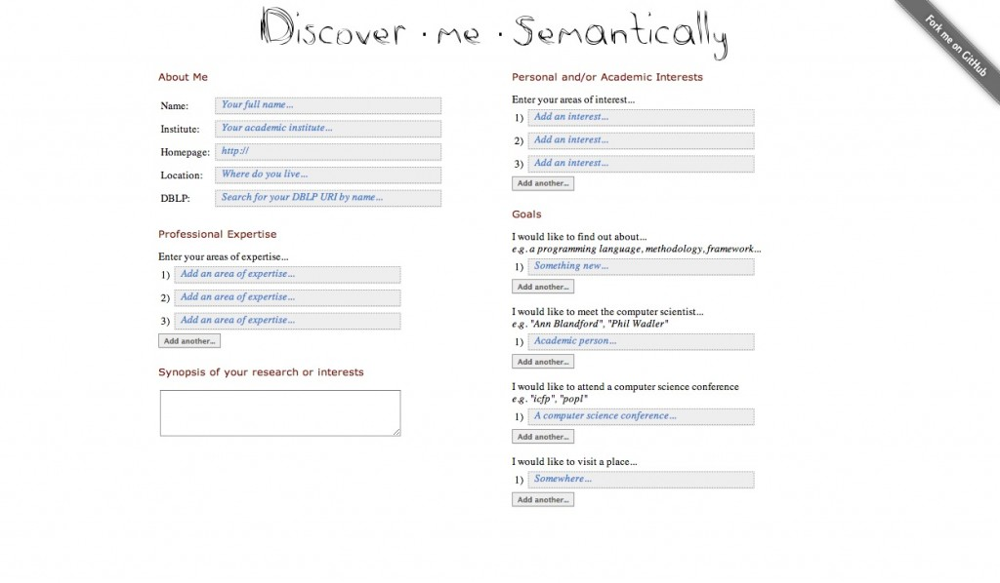
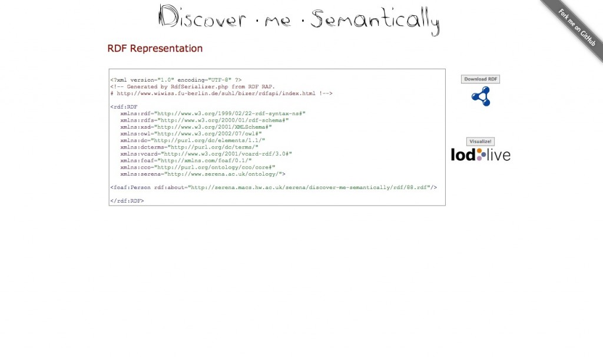
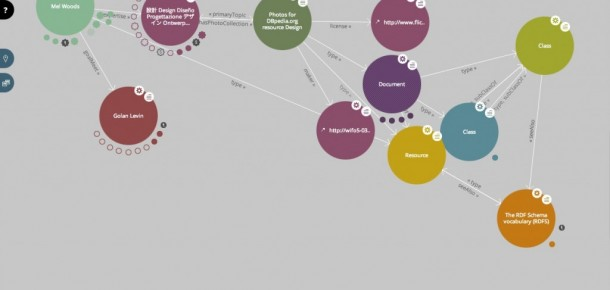

# Introduction

Discover·me·Semantically is an online web tool enabling authorship and download of RDF, and RDF visualization in Linked Open Data.

Discover·me·Semantically eases the pain of:
- Downloading personalized RDF files
- Visualizing the embedded RDF content in Linked Open Data (with [LodLive](http://en.lodlive.it/))

This work has been carried out in the [SerenA](http://www.serena.ac.uk) project, as part of a larger investigation on the potential of serendipitous discovery with linked open data.

## Citing this tool

If you wish to cite this work, please use this bibtex:

```
@inproceedings{DBLP:conf/paams/ForthGWSBAMMSW13a,
  author    = {Jamie Forth and
               Athanasios Giannimaras and
               Geraint A. Wiggins and
               Robert J. Stewart and
               Diana Bental and
               Ruth Aylett and
               Deborah Maxwell and
               Hadi Mehrpouya and
               Jamie Shek and
               Mel Woods},
  title     = {{Demonstrating SerenA: Chance Encounters in the Space of Ideas}},
  booktitle = {Advances on Practical Applications of Agents and Multi-Agent Systems,
               11th International Conference, {PAAMS} 2013, Salamanca, Spain, May
               22-24, 2013. Proceedings},
  pages     = {275--278},
  year      = {2013},
  volume    = {7879},
  publisher = {Springer}
}
```

## Example

The interface starts with an input form:



The generated RDF is given back:



It can be displayed with the LOD Live tool directly:




# Installation

- PHP rdf libraries

Due to the large file size, I have omitted the php libraries from this repository.

To add it, [download it](http://sourceforge.net/projects/rdfapi-php/files/latest/download)

```
unzip rap-v096.zip
mv rdfapi-php/ /location/to/discover-me-semantically/include/
```

- Apache write permissions

Apache needs to write RDF files to the rdf/ directory when a user wishes to visualize their RDF with LodLive. To allow Apache to do this:

```
chmod 777 rdf/
```

# TODO

- Achieve triple-A [compliance](http://jigsaw.w3.org/css-validator/) for CSS code
- Enable the feature to publish RDF to [Sindice](http://sindice.com/) using their ping service (currently disabled)
- Add a URI description mechanism, allowing users to confidently select the most appropriate URIs
- Add more searching backends. Currently the DBpedia lookup and Sindice search services are used. Ideas... FactForge, British Library. What else?
- More input fields. What other properties might users want to declare? The current form is a fairly minimal list
- Formalize the goal ontology. The current select box presents four types of goals. What other goals might people have, and what should the vocabulary look like. It is also desirable to be able to resolve the namespace for the SerenA vocabulary.

## Collaboration

We're **very** open to pull requests! If you'd like to collaborate, offer feedback, or best of all - better code, feel free to do so. Please use the issues section on this github repository.
